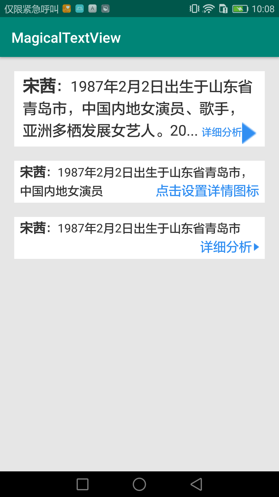

# MagicalTextView
[](https://jitpack.io/#yangsanning/MagicalTextView)

## 效果预览

<p> 


## 主要文件
| 名字             | 摘要           |
| ---------------- | -------------- |
| MagicalTextView | 末尾增加详情点击按钮的TextView |

### 1. 基本用法

```android
<ysn.com.magicaltextview.MagicalTextView
      android:layout_width="match_parent"
      android:layout_height="wrap_content"
      android:background="@android:color/white"
      app:mtv_details_image_height="30dp"
      app:mtv_details_image_width="20dp"
      app:mtv_padding_bottom="12dp"
      app:mtv_details_text="详细分析"
      app:mtv_force_max_height="true"
      app:mtv_default_text="@string/text1"
      app:mtv_details_text_color="@color/mtv_details_text_color"
      app:mtv_max_line="3"
      app:mtv_row_width="10dp"
      app:mtv_bold_text_size="18sp"
      app:mtv_padding_left="12dp"
      app:mtv_default_text_size="16sp"
      app:mtv_details_image="@drawable/ic_arrow_blue"
      app:mtv_padding_right="12dp"
      app:mtv_padding_top="12dp"
      app:mtv_details_text_size="11sp" />
```

### 2. 配置属性([Attributes](https://github.com/yangsanning/MagicalTextView/blob/master/magicaltextview/src/main/res/values/attrs.xml))

|name|format|description|
|:---:|:---:|:---:|
|mtv_padding_left |dimension |左边距 |
|mtv_padding_top |dimension |上边距 |
|mtv_padding_right |dimension |右边距 |
|mtv_padding_bottom |dimension |下边距 |
|mtv_bold_text_color |color |文本开头加粗文本颜色 |
|mtv_bold_text_size |dimension |文本开头加粗文本字号 |
|mtv_bold_end_index |integer |文本开头加粗文本结束的index |
|mtv_default_text_color |color |默认文本颜色 |
|mtv_default_text_size |dimension |默认文本字号 |
|mtv_default_text |string |默认文本 |
|mtv_details_text_color |color |详情分析文本颜色 |
|mtv_details_text_size |dimension |详情分析文本字号 |
|mtv_details_text |string |详情分析文本 |
|mtv_details_margin_left |dimension |详情分析距离默认文本的左边距 |
|mtv_details_image |reference |文本末尾小图标 |
|mtv_details_image_width |dimension |文本末尾小图标宽度 |
|mtv_details_image_height |dimension |文本末尾小图标高度 |
|mtv_details_image_margin_left |dimension |文本末尾小图标距离详情分析的左边距 |
|mtv_row_width |dimension |行宽 |
|mtv_max_line |integer |最大行数 |
|mtv_force_max_height |boolean |文本行数小于最大行数时, 是否强制高度 |


### 3.添加方法

#### 3.1 添加仓库

在项目的 `build.gradle` 文件中配置仓库地址。

```android
allprojects {
	repositories {
		...
		maven { url 'https://jitpack.io' }
	}
}
```

#### 3.2 添加项目依赖

在需要添加依赖的 Module 下添加以下信息，使用方式和普通的远程仓库一样。

```android
implementation 'com.github.yangsanning:MagicalTextView:v1.0.7'
```
